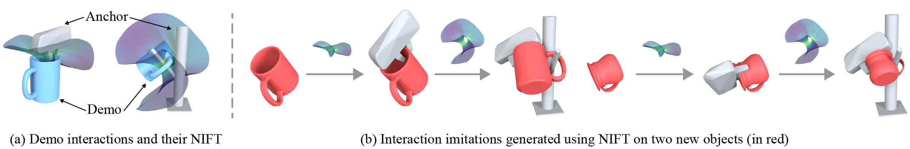
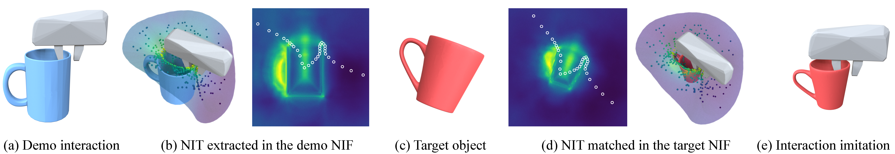
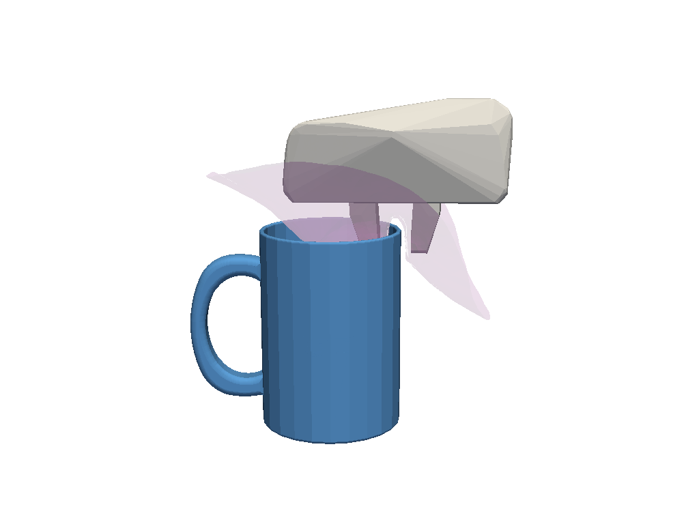
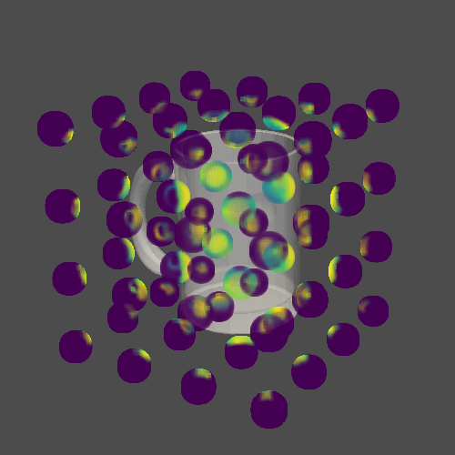
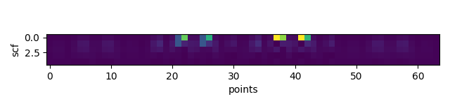
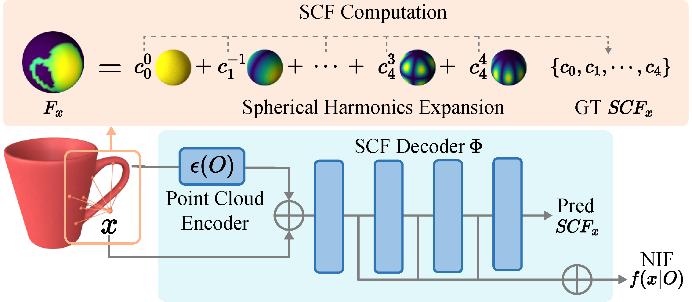

# NIFT

This is the official Pytorch implementation of the paper:

NIFT: Neural Interaction Field and Template for Object Manipulation. ICRA. 2023.

Zeyu Huang, Juzhan Xu, Sisi Dai, [Kai Xu](https://www.cs.sfu.ca/~haoz/), [Hao Zhang](https://www.cs.sfu.ca/~haoz/), [Hui Huang](https://vcc.tech/~huihuang/home), [Ruizhen Hu](https://csse.szu.edu.cn/staff/ruizhenhu/index.htm)

Paper: [arxiv](https://arxiv.org/abs/2210.10992) Homepage: [NIFT](https://github.com/zzilch/NIFT)




# Installation

We use the same environment as [NDF](https://github.com/anthonysimeonov/ndf_robot).
Addtional dependencies are listed below:

```
# libibs
conda install compilers make cmake qhull pybind11 -c conda-forge
pip install git+https://github.com/zzilch/libibs
# libscf
pip install git+https://github.com/zzilch/libscf
```

# Methods

## IBS
Interaction Bisector Surface (IBS) are equidistant to two interacting objects. 

Check `python tutorial/compute_ibs.py` to see how to compute IBS between two objects.



## SCF
SCF is the power spectrum of the normalized spherical function of a point to the object.

Check `python tutorial/compute_scf.py` to see how to copmute SCF of an point relative to an object.





## NIF
NIF is the concatenated neural activations of the SCF prediction network.



## NIT
NIT is the IBS points in the interaction and their associated NIF feature.

# Training

Please first download data according to the intructions of [NDF](https://github.com/anthonysimeonov/ndf_robot). Then run the following command to generate SCFs for traning.

```
NDF_SOURCE_DIR=/path/to/ndf_robot python scripts/batch_compute_scf.py
```

Then run the following command to train the model.

```
NDF_SOURCE_DIR=/path/to/ndf_robot python scripts/train.py --obj_class all --experiment_name nif
```

# Test

@todo